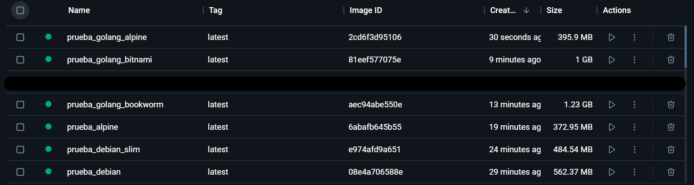

# Imágenes Docker
## Requisitos de aceptación
- **Mantenimiento**: Que una imagen se mantenga actualizada es importante para estar a la última de las novedades y sin riesgo de producir una deuda técnica futura, además de reducir posibles brechas de seguridad.
    - Se valorará que tenga actualizaciones recientes.

- **Tamaño**: Por norma general una imagen pequeña estará más enfocada y será más eficiente que una de mayor tamaño.
    - Se priorizarán imágenes con menor tamaño final.

- **Insignias**: En DockerHub exiten unas insignias llamadas "Trusted Content" que indican si la imagen es *Oficial*, si es de un *Creador Verificado* o si es de *Código Abierto*. La concesión de alguna de estas insignias indican contenido de calidad por lo que:
    - Se seleccionarán imágenes con insignias.

## Opciones
### **[Golang](https://hub.docker.com/_/golang)**
Su versión BookWorm basada en Debian 12, cuenta con 58 vulnerabilidades registradas. La versión BullsEye no se escogió debido que esta basada en Debian 11 por lo que es preferible usar una versión más reciente.
- Última actualización hace horas.
- Desarrollador oficial.

### **[Golang](https://hub.docker.com/_/golang)**
Su versión Alpine basada en Linux.
- Última actualización hace días.
- Desarrollador oficial.

### **[Bitnami](https://hub.docker.com/r/bitnami/golang)**
- Última actualización hace días.
- Desarrollador verificado.

### **[Debian](https://hub.docker.com/_/debian)**
Versión "latest".
- Última actualización hace días.
- Desarrollador oficial.

### **[Debian](https://hub.docker.com/_/debian)**
Versión "Stable-Slim".
- Última actualización hace días.
- Desarrollador oficial.

### **[Alpine](https://hub.docker.com/_/alpine)**
- Última actualización hace días.
- Desarrollador oficial.

## Conclusión

Dado que todas las imágenes tienen insignias y actualizaciones recientes, el criterio discriminativo será el tamaño:

A partir de la imagen, podemos ver que las imágenes con mayor tamaño son, evidentemente, las versiones que no son reducidas, como "Bitnami Golang", "Golang BookWorm" y "Debian". Las siguientes son "Debian Slim" y "Golang Alpine". Por último y como elección queda "Linux Alpine" que consigue el menor tamaño una vez instalado todo lo necesario.