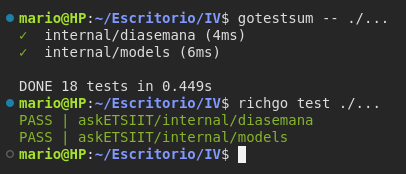

## Herramienta CLI de ejucción

Nuestro proyecto está siendo programado en Go el cuál incluye `go test`, una herramienta integrada de forma nativa en el ecosistema desde la versión **1.0**.

Será nuestra elección como herramienta de ejecución de test ya que sigue las mejores prácticas, como se menciona en el [guión del objetivo](https://jj.github.io/IV/documentos/proyecto/4.Tests), otras características por las que vela **go test** son la simplicidad y facilidad de uso pero sin perder eficacia.

## Alternativas
Existen otras herramientas que sustituyen a *go test*, la mayoría incluídas en un framework como [**GoConvey**](https://smartystreets.github.io/goconvey/) y [**Ginkgo**](https://onsi.github.io/ginkgo/) mencionadas en el dicho [documento](./test_frameworks.md).

Otras opciones que simulan el sistema de testing de Go como pueden ser `GoTestSum` y `RichGo`. La carácterística principal de estas herramientas es que añaden a la salida un *formateo* de la salida, añadiendo colores y una sintaxis más legible.

